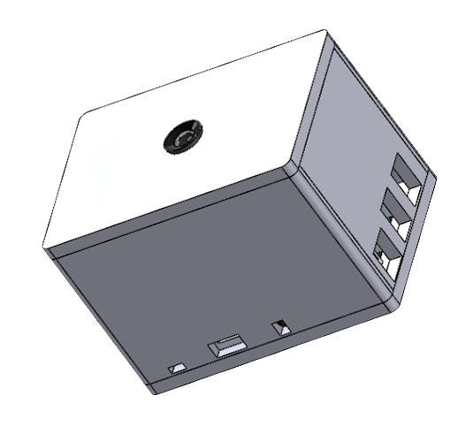
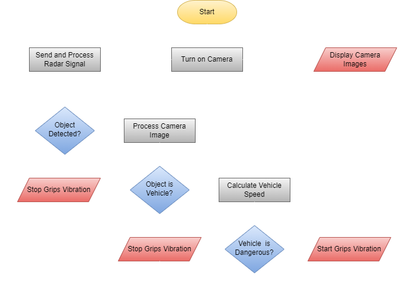
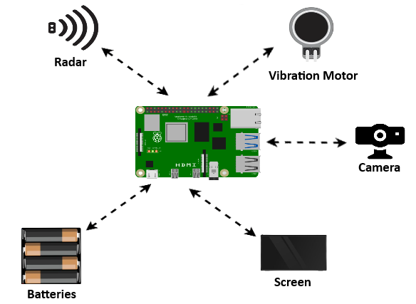

# Undead Zone
## A universal safety device for pedestrian conveyances.

 

## Features
- Image Processing - detects vehicles.
- Real-Time Video - displays the dead zone.
- Object Detection - detects nearby objects (helps accuracy).
- Grips Vibration - alerts from dangerous vehicles.

## Algorithm
First, the camera starts capturing images, which are displayed asynchronously on the screen. 
After that, a radar signal is sent to check for nearby objects. If something is picked up, the program starts processing the captured images. 
If the detected object is not a vehicle, the image processing stops, and the radar operation continues. Otherwise, the program checks whether the detected vehicle poses a possible danger to the user. 
If it does not pose a danger, the program continues to process the captured images. If the program has perceived that the vehicle may pose a danger to the user, it activates the grips vibration mechanism to alert the user of the possible danger. 
As soon as the user is out of danger, the grips vibration mechanism stops.

## Flow Chart

## Device Diagram

## License
Distributed under the MIT License. See LICENSE.txt for more information.
